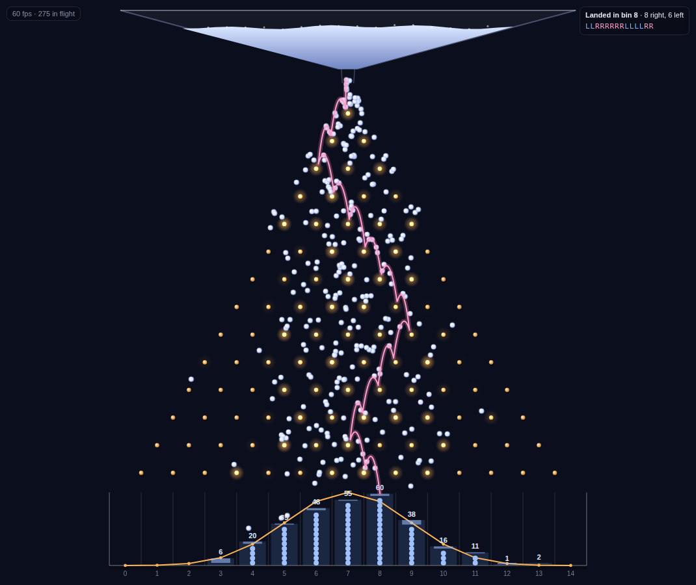

# Galton Board

An interactive [Galton board](https://en.wikipedia.org/wiki/Galton_board) in a single HTML file. Thousands of balls drain from a hopper and bounce down a triangle of pegs under gravity. They pile up into a bell curve, and the result is compared live against the binomial distribution it should follow.

**▶ [Open the simulator](https://cnicholson123.github.io/galton-board/)**



## Features

- **Exactly binomial.** Every peg strike is one independent coin flip, so the bins follow Binomial(rows, p). The live χ² goodness-of-fit test pools sparse tail bins and reports a p-value.
- **Tilt the board.** Set P(bounce right) anywhere from 0.1 to 0.9 and watch the distribution skew. The theory curve follows.
- **Trace a ball.** Drop one highlighted ball, see its arc through the lattice, and read off every left/right decision. Its bin is simply its number of rights.
- **Normal approximation overlay.** Shows the central limit theorem at work as you add rows.
- **Eye candy.** Pegs glow when struck, plus optional rainbow balls and motion trails.
- **Tunable physics.** Gravity, bounciness, scatter, ball size, sim speed, drop rate and hopper capacity. None of these change the odds, only how the bounces look.
- **Runs on phones.** The layout is responsive, and it stays at 60 fps with thousands of balls in flight thanks to sprite blitting and O(1) per-ball physics.

## Keyboard shortcuts

| Key     | Action                |
|---------|-----------------------|
| `Space` | Play / pause          |
| `R`     | Reset and refill      |
| `F`     | Refill hopper only    |
| `T`     | Trace a ball          |
| `1`     | Drop 100 balls        |
| `2`     | Drop 1000 balls       |

## How it works

Each ball always knows which peg it's falling toward, where on that peg's crown it will hit, and a pre-drawn coin flip for which way it will go there. When it reaches the contact point, it is launched on a real projectile arc. The arc is solved to land on the far side of the neighbouring peg one row down, positioned so that the *next* coin flip decides which side it glances off.

After *n* rows, a ball's bin *k* is the number of times it went right, so bin counts follow Binomial(*n*, *p*), with mean *np* and variance *np*(1 − *p*).

Earlier versions used free collision physics. Their bounces turned out to be correlated, since a ball that hits right of center tends to keep hitting right of center, and the tails came out far too fat (χ² in the thousands). The planned-strike model keeps the visible physics and gets the statistics exactly right.

## Running locally

No build step and no dependencies. Open `index.html` in a browser, or serve the folder:

```sh
npx http-server .
```
